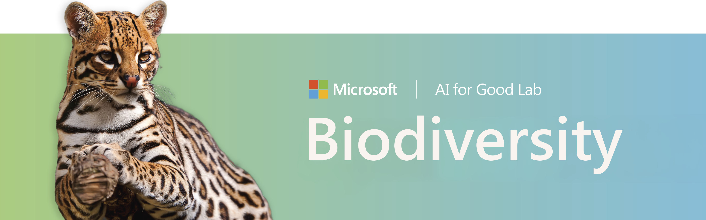

<div align="center"> 
<font size="6"> Open-source AI for camera traps, bioacoustics, and wildlife monitoring </font>
<br>
<hr>
<a href="https://pypi.org/project/PytorchWildlife"></a> 
<a href="https://pypi.org/project/PytorchWildlife"></a> 
<a href="https://pypi.org/project/PytorchWildlife"></a> 
<a href="https://huggingface.co/spaces/ai-for-good-lab/pytorch-wildlife"></a>
<a href="https://colab.research.google.com/drive/1rjqHrTMzEHkMualr4vB55dQWCsCKMNXi?usp=sharing"></a>
<a href="https://github.com/microsoft/Biodiversity/blob/main/LICENSE"></a>
<a href="https://discord.gg/TeEVxzaYtm"></a>
<br><br>
</div>


## 👋 Welcome to PyTorch-Wildlife
**PyTorch-Wildlife** is an AI platform designed for the AI for Conservation community to create, modify, and share powerful AI conservation models. It allows users to directly load a variety of models including [MegaDetector](https://github.com/microsoft/MegaDetector), [DeepFaune](https://www.deepfaune.cnrs.fr/en/), and [HerdNet](https://github.com/Alexandre-Delplanque/HerdNet) from our ever expanding [model zoo](model_zoo/megadetector.md) for both animal detection and classification.

Our scope now spans well beyond camera-trap imagery — we have active work in [MegaDetector-Acoustic](bioacoustics.md) for bioacoustic species identification, [MegaDetector-Overhead](model_zoo/other_detectors.md) for aerial wildlife detection, and edge computing for remote field deployments.

> **Coming from an older version?** OWL is now **MegaDetector-Overhead**, the bioacoustics module is now **MegaDetector-Acoustic**, and the repo has moved from `microsoft/CameraTraps` to `microsoft/Biodiversity` (old links redirect automatically). See the [full naming changes](releases/release_notes.md#naming-changes) in the v1.3.0 release notes.


## 🚀 Quick Start

👇 Here is a brief example on how to perform detection and classification on a single image using `PyTorch-Wildlife`
```python
import numpy as np
from PytorchWildlife.models import detection as pw_detection
from PytorchWildlife.models import classification as pw_classification

img = np.random.randn(3, 1280, 1280)

# Detection
detection_model = pw_detection.MegaDetectorV6() # Model weights are automatically downloaded.
detection_result = detection_model.single_image_detection(img)

#Classification
classification_model = pw_classification.AI4GAmazonRainforest() # Model weights are automatically downloaded.
classification_results = classification_model.single_image_classification(img)
```

## ⚙️ Install PyTorch-Wildlife
```
pip install PytorchWildlife
```
Please refer to our [installation guide](installation.md) for more installation information.


## 🖼️ Examples

### Image detection using `MegaDetector`
<br>
*Credits to Universidad de los Andes, Colombia.*

### Image classification with `MegaDetector` and `AI4GAmazonRainforest`
<br>
*Credits to Universidad de los Andes, Colombia.*

### Opossum ID with `MegaDetector` and `AI4GOpossum`
<br>
*Credits to the Agency for Regulation and Control of Biosecurity and Quarantine for Galápagos (ABG), Ecuador.*
